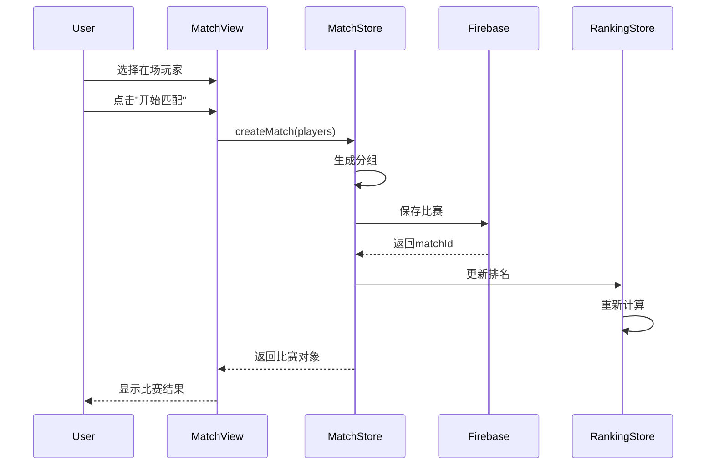

# 1 组件详细设计

## 1.1 PlayerCard.vue - 玩家卡片组件
```typescript
// Props接口
interface PlayerCardProps {
  player: Player;
  showCheckbox?: boolean;
  checked?: boolean;
  disabled?: boolean;
  size?: 'small' | 'medium' | 'large';
}

// 事件
interface PlayerCardEmits {
  'update:checked': [value: boolean];
  'click': [player: Player];
}

// 功能
- 显示玩家头像、名称、类型标签
- 支持checkbox选择状态
- 支持点击事件
- 响应式布局适配
```

## 1.2 MatchResult.vue - 比赛结果组件
```typescript
// Props接口
interface MatchResultProps {
  match: Match;
  players: Player[];
  showTime?: boolean;
  compact?: boolean;
}

// 功能
- 显示两队对战结果
- 高亮获胜方
- 显示比分和玩家名称
- 支持紧凑模式（用于明细列表）
- 显示比赛时间
```

## 1.3 RankTable.vue - 排名表格组件
```typescript
// Props接口
interface RankTableProps {
  rankings: PlayerRanking[] | TeamRanking[];
  type: 'player' | 'team';
  loading?: boolean;
  season: string;
}

// 功能
- 支持个人和组合排名显示
- 响应式表格/卡片切换
- 排序和筛选功能
- 加载状态显示
```

# 2 状态管理详细实现

## 2.1 Player Store (stores/player.ts)
```typescript
interface PlayerState {
  players: Map<string, Player>;
  presentPlayers: Set<string>;
  currentUserId: string | null;
  loading: boolean;
}

const actions = {
  async loadPlayers(): Promise<void> {
    // 1. 从IndexedDB加载本地数据
    const localPlayers = await db.getPlayers();
    
    // 2. 同步Firebase数据
    const remotePlayers = await firebase.getPlayers();
    
    // 3. 合并数据（以服务器为准）
    const merged = mergePlayers(localPlayers, remotePlayers);
    
    // 4. 更新状态
    this.players = new Map(merged.map(p => [p.id, p]));
    
    // 5. 缓存到IndexedDB
    await db.savePlayers(merged);
  },
  
  async addPlayer(player: Omit<Player, 'id' | 'createdAt' | 'updatedAt'>): Promise<string> {
    const newPlayer: Player = {
      ...player,
      id: generateId(),
      createdAt: new Date(),
      updatedAt: new Date()
    };
    
    // 乐观更新
    this.players.set(newPlayer.id, newPlayer);
    
    try {
      await firebase.addPlayer(newPlayer);
      await db.savePlayer(newPlayer);
    } catch (error) {
      // 回滚
      this.players.delete(newPlayer.id);
      throw error;
    }
    
    return newPlayer.id;
  },
  
  togglePresent(playerId: string): void {
    const player = this.players.get(playerId);
    if (player) {
      player.isPresent = !player.isPresent;
      player.updatedAt = new Date();
      
      // 同步到服务器
      firebase.updatePlayer(playerId, { isPresent: player.isPresent });
    }
  }
};
```

## 2.2 Match Store (stores/match.ts)
```typescript
interface MatchState {
  matches: Map<string, Match>;
  currentSeason: string;
  loading: boolean;
}

const actions = {
  async createMatch(players: string[]): Promise<Match> {
    if (players.length !== 4) {
      throw new Error('需要4名玩家');
    }
    
    // 1. 生成分组
    const [teamA, teamB] = this.generateTeams(players);
    
    // 2. 创建比赛
    const match: Match = {
      id: generateId(),
      season: getCurrentSeason(),
      teamA: teamA as [string, string],
      teamB: teamB as [string, string],
      scoreA: 0,
      scoreB: 0,
      winner: 'A',
      playedAt: new Date(),
      createdAt: new Date()
    };
    
    // 3. 保存到服务器
    await firebase.addMatch(match);
    await db.saveMatch(match);
    
    // 4. 更新本地状态
    this.matches.set(match.id, match);
    
    // 5. 触发排名更新
    await rankingStore.recalculateRanking(match.season);
    
    return match;
  },
  
  generateTeams(players: string[]): [string[], string[]] {
    // 实现随机分组算法
    const shuffled = [...players].sort(() => Math.random() - 0.5);
    return [shuffled.slice(0, 2), shuffled.slice(2, 4)];
  },
  
  async updateMatchScore(matchId: string, scoreA: number, scoreB: number): Promise<void> {
    const match = this.matches.get(matchId);
    if (!match) return;
    
    match.scoreA = scoreA;
    match.scoreB = scoreB;
    match.winner = scoreA > scoreB ? 'A' : 'B';
    
    await firebase.updateMatch(matchId, {
      scoreA,
      scoreB,
      winner: match.winner
    });
    
    await rankingStore.recalculateRanking(match.season);
  }
};
```

# 3 算法具体实现

## 3.1 智能分组算法
```typescript
function smartTeamFormation(players: string[]): [string[], string[]] {
  const allCombinations = generateAllCombinations(players);
  const history = matchStore.getMatchHistory();
  
  // 计算每种组合的历史对战次数
  const scoredCombinations = allCombinations.map(combo => ({
    teams: combo,
    score: calculateBalanceScore(combo, history)
  }));
  
  // 选择最平衡的组合
  const bestCombo = scoredCombinations.reduce((best, current) => 
    current.score > best.score ? current : best
  );
  
  return bestCombo.teams;
}

function calculateBalanceScore(
  teams: [string[], string[]], 
  history: Match[]
): number {
  const [teamA, teamB] = teams;
  
  // 1. 历史对战次数权重（越少越好）
  const headToHeadCount = history.filter(m => 
    (teamA.includes(m.teamA[0]) && teamB.includes(m.teamB[0])) ||
    (teamA.includes(m.teamB[0]) && teamB.includes(m.teamA[0]))
  ).length;
  
  // 2. 个人胜率平衡度
  const winRates = [...teamA, ...teamB].map(p => 
    rankingStore.getPlayerWinRate(p)
  );
  const balanceScore = 1 - (Math.max(...winRates) - Math.min(...winRates));
  
  // 3. 组合权重
  return (1 / (headToHeadCount + 1)) * 0.7 + balanceScore * 0.3;
}
```

## 3.2 排名计算算法
```typescript
function calculatePlayerRanking(season: string): PlayerRanking[] {
  const matches = matchStore.getMatchesBySeason(season);
  const players = playerStore.getAllPlayers();
  
  const stats = new Map<string, { wins: number; total: number; lastMatch: Date }>();
  
  // 统计每个玩家的数据
  matches.forEach(match => {
    const winnerTeam = match.winner === 'A' ? match.teamA : match.teamB;
    const loserTeam = match.winner === 'A' ? match.teamB : match.teamA;
    
    [...winnerTeam, ...loserTeam].forEach(playerId => {
      if (!stats.has(playerId)) {
        stats.set(playerId, { wins: 0, total: 0, lastMatch: match.playedAt });
      }
      
      const stat = stats.get(playerId)!;
      stat.total++;
      if (winnerTeam.includes(playerId)) {
        stat.wins++;
      }
      stat.lastMatch = match.playedAt > stat.lastMatch ? match.playedAt : stat.lastMatch;
    });
  });
  
  // 排序
  return Array.from(stats.entries())
    .map(([playerId, stat]) => ({
      playerId,
      season,
      rank: 0, // 后续计算
      winRate: stat.wins / stat.total,
      wins: stat.wins,
      totalGames: stat.total,
      lastMatchAt: stat.lastMatch
    }))
    .sort((a, b) => {
      // 按胜率降序
      if (b.winRate !== a.winRate) return b.winRate - a.winRate;
      // 胜率相同按胜场降序
      if (b.wins !== a.wins) return b.wins - a.wins;
      // 胜场相同按总场数升序
      if (a.totalGames !== b.totalGames) return a.totalGames - b.totalGames;
      // 总场数相同按最近比赛时间升序
      return a.lastMatchAt.getTime() - b.lastMatchAt.getTime();
    })
    .map((ranking, index) => ({ ...ranking, rank: index + 1 }));
}
```

# 4 数据流程设计

## 4.1 比赛创建流程


## 4.2 数据同步流程
```typescript
class SyncManager {
  private syncQueue: SyncTask[] = [];
  private isOnline = navigator.onLine;
  
  async syncData(): Promise<void> {
    if (!this.isOnline) return;
    
    const pendingTasks = await db.getPendingSync();
    
    for (const task of pendingTasks) {
      try {
        await this.executeSync(task);
        await db.markSynced(task.id);
      } catch (error) {
        console.error('Sync failed:', error);
        // 重试机制
        await this.scheduleRetry(task);
      }
    }
  }
  
  private async executeSync(task: SyncTask): Promise<void> {
    switch (task.type) {
      case 'create':
        await firebase.create(task.collection, task.data);
        break;
      case 'update':
        await firebase.update(task.collection, task.id, task.data);
        break;
      case 'delete':
        await firebase.delete(task.collection, task.id);
        break;
    }
  }
}
```

# 5 接口设计

## 5.1 RESTful API设计
```typescript
// 玩家相关
GET    /api/players          // 获取所有玩家
POST   /api/players          // 创建玩家
PUT    /api/players/:id      // 更新玩家
DELETE /api/players/:id      // 删除玩家

// 比赛相关
GET    /api/matches          // 获取比赛列表
GET    /api/matches/:season  // 获取指定赛季比赛
POST   /api/matches          // 创建比赛
PUT    /api/matches/:id      // 更新比赛结果
DELETE /api/matches/:id      // 删除比赛

// 排名相关
GET    /api/rankings/:season/players  // 获取个人排名
GET    /api/rankings/:season/teams    // 获取组合排名
```

# 6 错误处理机制

## 6.1 全局错误处理
```typescript
// 错误类型定义
enum ErrorType {
  NETWORK_ERROR = 'NETWORK_ERROR',
  VALIDATION_ERROR = 'VALIDATION_ERROR',
  PERMISSION_ERROR = 'PERMISSION_ERROR',
  SYNC_ERROR = 'SYNC_ERROR'
}

class ErrorHandler {
  static handle(error: AppError): void {
    switch (error.type) {
      case ErrorType.NETWORK_ERROR:
        ElMessage.error('网络连接失败，已切换到离线模式');
        break;
      case ErrorType.VALIDATION_ERROR:
        ElMessage.error(error.message);
        break;
      case ErrorType.SYNC_ERROR:
        ElMessage.warning('数据同步失败，将在网络恢复后重试');
        break;
    }
    
    // 记录错误日志
    console.error(error);
    this.logError(error);
  }
  
  private static logError(error: AppError): void {
    const log = {
      timestamp: new Date().toISOString(),
      type: error.type,
      message: error.message,
      stack: error.stack
    };
    
    db.saveErrorLog(log);
  }
}
```

# 7 测试策略

## 7.1 单元测试
```typescript
// 测试用例示例
describe('PlayerStore', () => {
  it('should add player correctly', async () => {
    const store = usePlayerStore();
    const playerData = { name: 'Test Player', type: '全能' };
    
    const playerId = await store.addPlayer(playerData);
    
    expect(store.players.has(playerId)).toBe(true);
    expect(store.players.get(playerId)?.name).toBe('Test Player');
  });
});

describe('Ranking Calculation', () => {
  it('should sort by win rate first', () => {
    const rankings = calculatePlayerRanking('2024-07');
    
    for (let i = 1; i < rankings.length; i++) {
      expect(rankings[i].winRate).toBeLessThanOrEqual(rankings[i-1].winRate);
    }
  });
});
```

## 7.2 集成测试
- 测试完整的比赛创建流程
- 测试数据同步机制
- 测试离线/在线状态切换
- 测试赛季切换功能

## 7.3 E2E测试
- 使用Cypress进行端到端测试
- 测试主要用户场景
- 验证响应式设计
- 测试错误处理流程